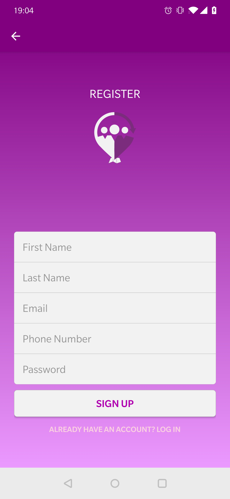
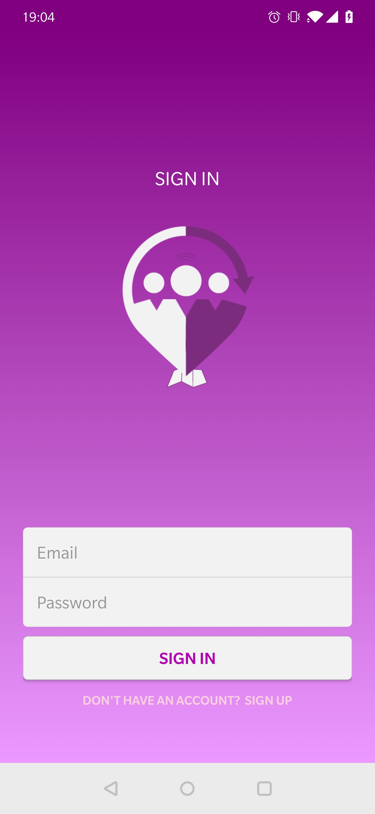
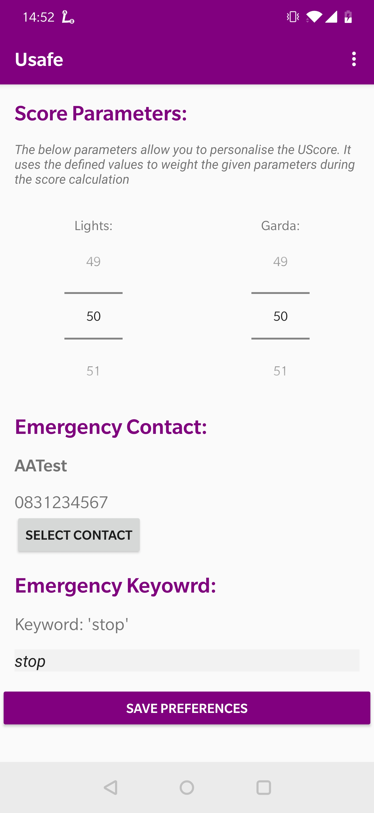
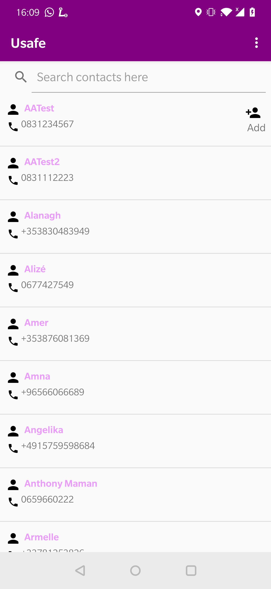
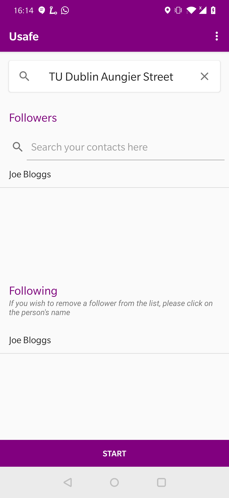
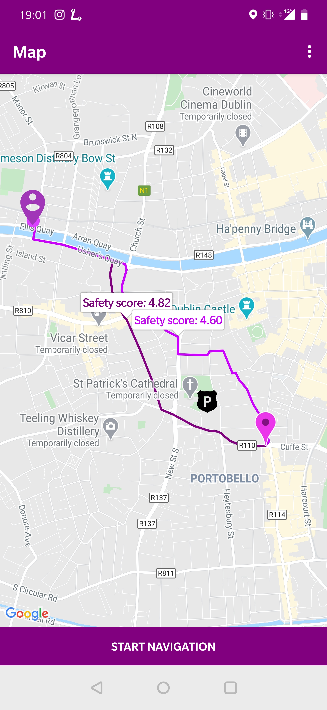
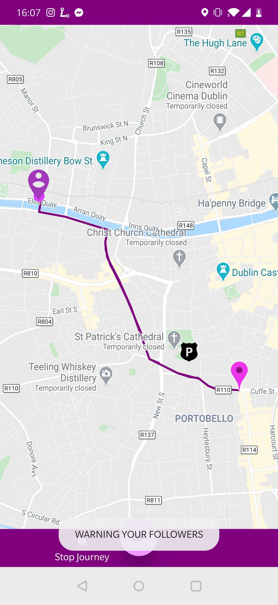
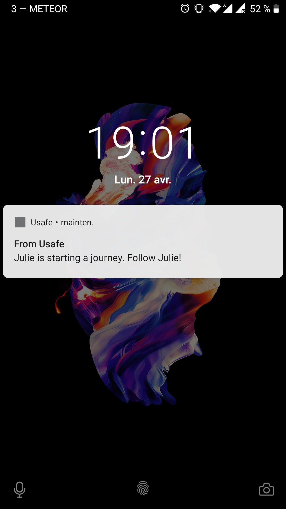

# User Manual
## Create an account 

In order to be able to use the application, the user must create an account. To access the registration page when launching Usafe on the login page, the user needs to click on the link “Don’t have an account? Sign up”. Then, the user must fill in all the fields such as first name, last name, email, phone number and password. The email address and the phone number have to  respect a specific format: email address must be of format: email@domain.com, and phone number must not contain country code prefix. Password needs to have minimum 8 characters. Lastly, email address must be unique. If any of those conditions are not fulfilled, a corresponding error message will be displayed and the account will not be created. 

## Login 

To sign in, the user must provide the email address and password he used to register. If any of these information is incorrect, an error message will be displayed. 
If login is successful, the user will be redirected to the main screen of the application.

## Define user preferences

 

##### Score parameters 
This section allows the user to personalise the Safety Score. The lights and garda stations values will be used as a weight in the score calculation.
The default values are 50 for lights and 50 for garda stations.

##### Emergency contacts
Usafe allows the user to select a contact from his phone as a contact to be called in case of an emergency.
The default emergency contact is 999.

##### Emergency keyword
The user can choose an emergency keyword. The default one is ‘help’. If the given keyword is detected during a journey (meaning the user would have said it), the application will immediately call the emergency contact.

## Add a contact 

  
The user will be prompted for permission to access the phone’s contacts. Once the permission granted, phone’s contacts will be displayed. The user will be able to add contacts who are also Usafe’s users as friends. The user will then be able to add those friends as followers when starting a journey.  

## Start a journey 

 

##### Select your destination
In order to start a journey, the commuter must provide a destination by filling the Google autocomplete field. After typing the first characters of his destination address, Google autocomplete will instantly provide a list of potential matching addresses.

##### Add some followers
Commuter’s friends will be displayed in a list as followers. Commuter will be able to select some of them before starting the journey. Selected ones will then be displayed in the ‘Following’ list.

##### Remove some followers
Commuter can remove some followers from the ‘following’ list by clicking on the follower’s name.

## Select your route 

  

Once the destination and the followers are chosen, a set of routes from commuter’s location to the final destination will be displayed on the map.
The commuter will be able to select one of the proposed routes. Each route will have a safety score (out of 5) that represents how safe the route is based on his preferences.

## Journey features 

##### Route deviation
During the journey, the application can identify if the commuter is not following the route. In that case, a notification will be sent to the followers indicating that the commuter is deviating from his route. If the commuter has no followers, it will instead call the emergency contact set in the profile section. 

##### End-user running
USafe has also the feature to detect if the commuter is running during his journey. As a result, a popup notification will be displayed on the commuter’s phone asking if everything is alright. If the commuter is not pressing the ‘yes’ button after 20 seconds, followers will be notified. If the commuter has no followers, it will call instead the emergency contact.
  

##### Calling for help
In a case that the emergency keyword is detected by the speech recognition, the application will immediately call the emergency contact. 
Take a snapshot video
In the event of potential threat, the commuter can click on the ‘SOS’ button. By doing so, the application will open the phone’s camera and the user will be able to record a video.

##### Stop journey
Once the journey completed, pressing the stop button will notify the followers that the journey is finished.

## Followers features

  

##### Starting journey notification

As soon as the commuter is starting the journey, followers will be notified. By clicking on the notification, followers will be able to see the chosen route and follow the commuter’s journey.

##### Route deviation notification

By clicking on the notification, the application will open the phone dialler with the commuter’s phone number. This way it makes it easier for the follower to call the user.

##### Running detection notification

Same behaviour as the route deviation notification, clicking will open the phone dialler with the commuter’s phone number.
 
